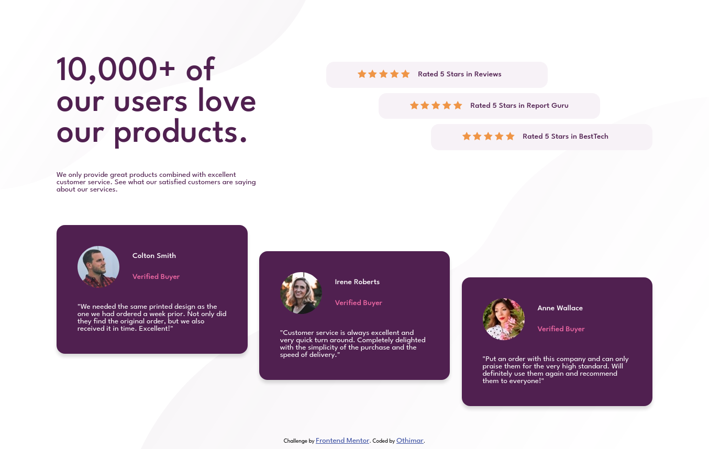

# Frontend Mentor - Social proof section solution

This is a solution to the [Social proof section challenge on Frontend Mentor](https://www.frontendmentor.io/challenges/social-proof-section-6e0qTv_bA).

## Table of contents

- [Overview](#overview)
  - [The challenge](#the-challenge)
  - [Screenshot](#screenshot)
  - [Links](#links)
- [My process](#my-process)
  - [Built with](#built-with)
  - [What I learned](#what-i-learned)
  - [Useful resources](#useful-resources)
- [Author](#author)


## Overview

### The challenge

Users should be able to:

- View the optimal layout for the section depending on their device's screen size

### Screenshot




### Links

- Live Site URL: [[othimar.github.io](https://othimar.github.io/frontend-mentor-social-proof-section/)](https://othimar.github.io/frontend-mentor-social-proof-section/)
- Source Code : [https://github.com/othimar/frontend-mentor-social-proof-section](https://github.com/othimar/frontend-mentor-social-proof-section)


### Built with

This project is built with HTML and CSS.


### What I learned
I learned that it is possible to specify more than one background for an element. 
```css
    body{
      background-image: url("./images/bg-pattern-top-desktop.svg"), url("./images/bg-pattern-bottom-desktop.svg");
    }
```

### Useful resources

- [W3CSchool](https://www.w3schools.com/) - For some CSS property
- [CSS Trick](https://css-tricks.com/firefoxs-bolder-default-is-a-problem-for-variable-fonts/)  - It helped me to understand something about font-weigth
-[MDN](https://developper.mozilla.org) - It helped me with css grid.

## Author
- Frontend Mentor - [@othimar](https://www.frontendmentor.io/profile/othimar)
- Twitter - [@othimarPele](https://www.twitter.com/othimarpele)

